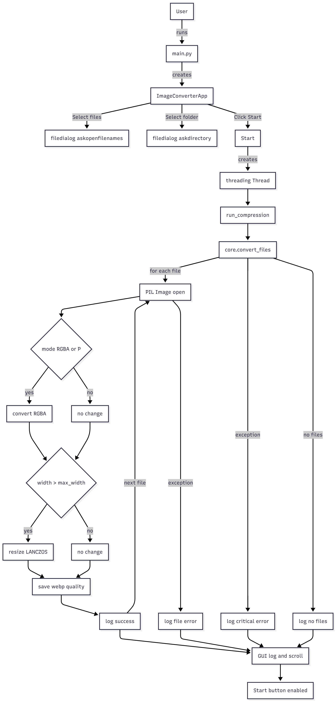

# WebP Converter (convert_app)

## ✨ Project Overview
WebP Converter is a desktop application designed for efficient, batch conversion of image files (such as JPEG and PNG) into the modern and space-saving WebP format. The application features a clean Graphical User Interface (GUI) built with CustomTkinter and utilizes the power of the Pillow (PIL) library for image processing.

Key features include:
- Batch processing of multiple input files.
- Option to set the maximum output width for resizing.
- Adjustable compression quality for the WebP output.
- Non-blocking UI thanks to multi-threading (threading module) for file operations.

## 🛠️ Installation and Setup
Prerequisites
Python 3.x

1. Clone the Repository
Start by cloning the project files from your GitHub repository:
```
git clone [https://github.com/pucio8/convert_app.git](https://github.com/pucio8/convert_app.git)
cd convert_app
```

2. Create and Activate Virtual Environment
It is highly recommended to use a virtual environment to manage dependencies:
```
python -m venv venv


#On Windows (PowerShell):
.\venv\Scripts\activate

# On Linux/macOS:
source venv/bin/activate
```

3. Install Dependencies
All necessary libraries are listed in your requirements.txt file:
```
pip install -r requirements.txt
```

▶️ Usage
To launch the application GUI:
```
python main.py
```

## 📐 Application Architecture
The project is structured to separate GUI elements from core conversion logic.
Dependency Graph (Internal)
The main.py file initializes the main application window (gui.py), which relies on the image processing logic (core.py) and user interface enhancements (tooltip.py).
```
graph LR
    M[main.py] --> G[gui.py]
    G --> C[core.py]
    G --> T[tooltip.py]
```

## Class Structure (Key Components)

| **Class** | **Module** | **Role** |
| :--- | :--- | :--- |
| `ImageConverterApp` | `image_converter/gui.py` | Manages the main window, UI elements, user interaction, and threading for compression. |
| `Core (Module)` | `image_converter/core.py` | Contains the `convert_files` function with PIL logic (open, convert mode, resize, save to WebP). |
| `Tooltip` | `image_converter/tooltip.py` | Provides helper messages on hover for UI elements. |

## Processing Flow

The conversion process is handled in the following sequence:

### Processing Flow

